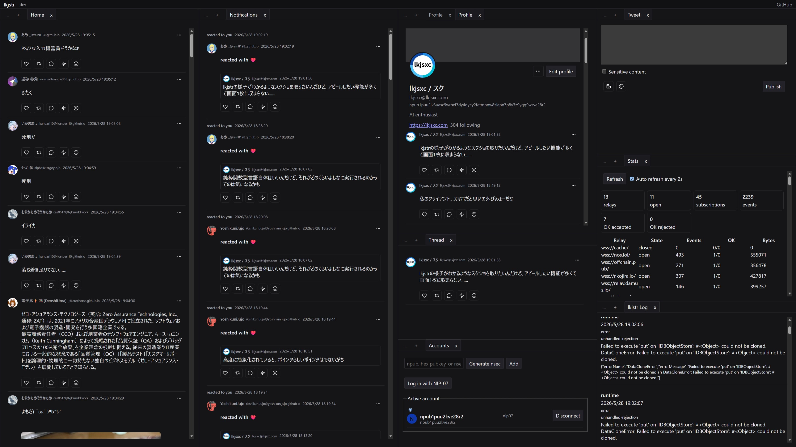

# lkjstr

## Purpose

lkjstr is a browser-first Nostr workspace. It opens directly into a tiled
desktop-style app for reading timelines, composing notes, inspecting relay
behavior, managing signing accounts, and following event threads without a
server-side account system.

## Table of Contents

- [Screenshot](#screenshot)
- [What lkjstr Is](#what-lkjstr-is)
- [What It Does](#what-it-does)
- [How to Run](#how-to-run)
- [How to Verify](#how-to-verify)
- [Where Docs Live](#where-docs-live)
- [Repository Map](#repository-map)
- [License](#license)

## Screenshot



## What lkjstr Is

- A **single-page workspace** that starts on `/` with no landing page.
- A **tiled pane manager** where you open, drag, and arrange tabs side by side.
- A **browser-native Nostr client** that stores workspace, account, settings,
  drafts, notifications, and cached events locally.
- A **relay-aware tool** that lets you inspect connections, run custom requests,
  and manage your own relay list without automatic protocol overrides.

## What It Does

### Reading

- **Home** - timeline of followed pubkeys.
- **Global** - public firehose with optional filters.
- **Profile** - a user's notes and metadata.
- **Thread** - reply chains with context.
- **Notifications** - mentions, reactions, reposts, zaps.
- **Search** - cached matches plus NIP-50 relay filters when supported.

### Writing

- **Tweet** - compose and publish notes.
- **Replies, reposts, reactions** - inline event actions.
- **Zaps** - open or copy NIP-57 invoices (wallet custody is out of scope).
- **Media upload** - NIP-96 upload with NIP-98 auth.
- **Custom emoji** - NIP-30 emoji parsing and publishing.
- **Profile Edit** - update active-account metadata.

### Tools

- **Accounts** - manage local signing keys and NIP-07 browser extensions.
- **Relay Settings** - user-owned relay list with explicit import for protocol hints.
- **Custom Request** - send raw Nostr filters to selected relays.
- **Stats** - relay diagnostics and connection metrics.
- **lkjstr Log** - current-session diagnostics.
- **Mine npub** - vanity local signing key generation.
- **Welcome** - onboarding and quick-start reference.

## How to Run

Requirements: Node.js >= 24, pnpm 11.1.2.

```sh
# Install dependencies
pnpm install

# Start the dev server
pnpm dev

# Build for production
pnpm build

# Preview the production build
pnpm preview
```

## How to Verify

Canonical quiet commands (one success line on pass; full output on failure):

```sh
pnpm check:repo
pnpm test:quiet
pnpm test:e2e:quiet
pnpm verify:quiet
pnpm ci:quiet
pnpm cloudflare:quiet

docker compose -f docker-compose.yml config
docker compose --progress quiet -f docker-compose.yml build app verify e2e cloudflare app-smoke
docker compose --progress quiet -f docker-compose.yml run --rm verify
docker compose --progress quiet -f docker-compose.yml run --rm e2e
docker compose --progress quiet -f docker-compose.yml run --rm cloudflare
docker compose --progress quiet -f docker-compose.yml run --rm app-smoke
```

See [docs/operations/verification.md](docs/operations/verification.md) for the
quiet verification contract.

### Debugging (verbose)

```sh
pnpm lint
pnpm check
pnpm test
pnpm verify
pnpm test:e2e
pnpm test:e2e:memory
pnpm cloudflare:dry-run
```

## Where Docs Live

All contracts live under [`docs/`](docs/README.md):

- **[docs/current-state.md](docs/current-state.md)** - implemented app state summary.
- **[docs/product/](docs/product/README.md)** - user-facing workspace behavior.
- **[docs/protocol/](docs/protocol/README.md)** - Nostr and relay protocol support.
- **[docs/architecture/](docs/architecture/README.md)** - runtime and data ownership.
- **[docs/operations/](docs/operations/README.md)** - verification, CI, and data safety.
- **[docs/repository/](docs/repository/README.md)** - layout, workflow, and style rules.
- **[docs/decisions/](docs/decisions/README.md)** - durable architectural decisions.
- **[docs/research/](docs/research/README.md)** - background notes and open questions.
- **[docs/vision/](docs/vision/README.md)** - long-term scope and principles.

## Repository Map

- [`.github/_README.md`](.github/_README.md) - GitHub Actions and repository
  automation notes.
- [`AGENTS.md`](AGENTS.md) - agent-facing repository rules.
- [`docs/`](docs/) - product, protocol, architecture, operations, and repository contracts.
- [`scripts/`](scripts/) - repository checks and quiet verification wrappers.
- [`src/`](src/) - SvelteKit application source.
- [`static/`](static/) - static browser assets and manifest files.
- [`tests/`](tests/) - Vitest unit tests and Playwright browser tests.

## License

See [`LICENSE`](LICENSE).
